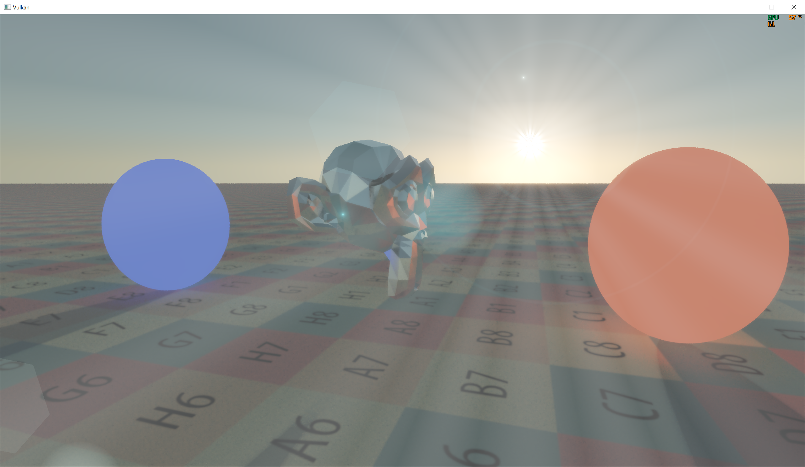
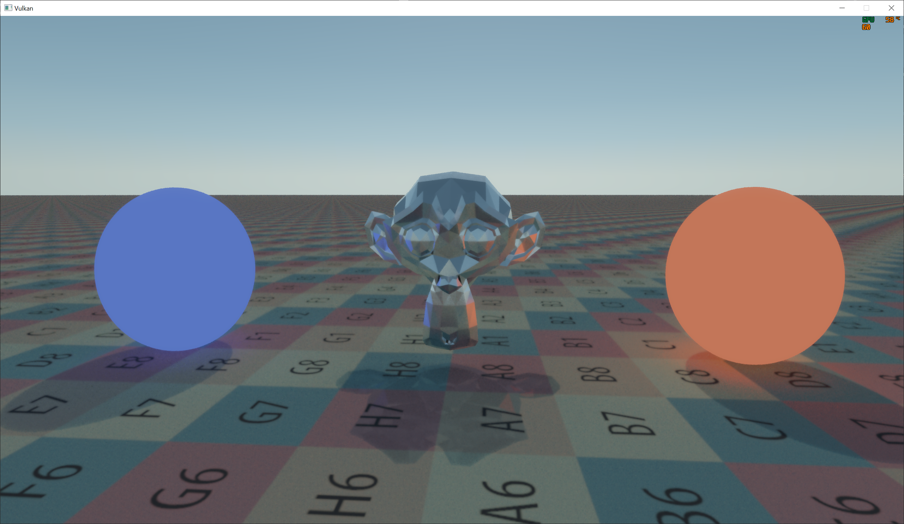
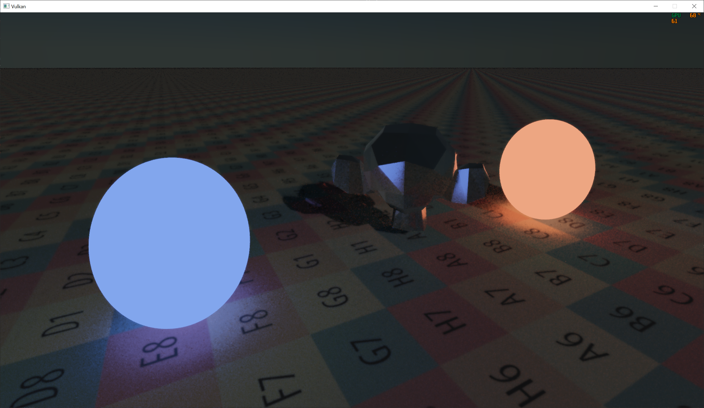
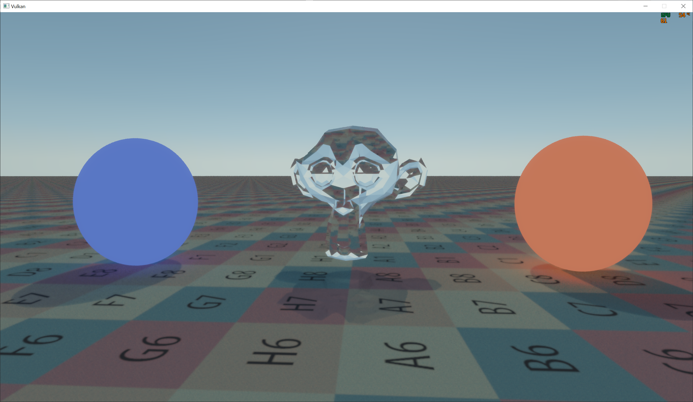

# Real-time Ray Tracing
- Physically based ray tracing / path tracing.
- GPU Compute workload implemented in CUDA.
- Real time rendering framework implemented with Vulkan.

## Screenshot
<table> <tr>
    <td>  </td>
    <td>  </td>
</tr> <tr>
    <td>  </td>
    <td>  </td>
</tr> </table>

## Physically based rendering
- Monte Carlo path tracing
- Surface BSDF models
- Rayleigh-Mie sky model
- Local light source

## Acceleration
### Variance reducing
- Low-discrepancy blue noise sampler
- Multiple importance sampling. Importance sampling BSDF and lights. Keep one sample per intersection. (need re-archtecture)

### Scene traversal
- LBVH
    - Two level BVH, each level with limited element count for better kernel efficiency
    - Triangle list -> AABB, morton codes, scene AABB
    - Radix sort -> Sorted morton codes, leaf reorder indices
    - LBVH build
    - BVH traversal using stack
- (todo) PLOC
    - Need local clustering

### Denoising
- Edge-aware `Atrous spatial + temporal filter
- (todo) A-SVGF
    - Multi-pass, large range spatial filters

### Optimizations
- Adaptive sampling
    - Noise level estimation
    - Currenly not in use. Curretnly using one sample per frame per pixel.
- Dynamic resolution

## Post-processing
- Eye adaptive histogram based auto exposure
- Bloom effect
- Lens flare
- Tone mapping
- Sharpening

## How to prepare and build
- Windows 10 OS
- cmake 3.10
- CUDA
- Vulkan
- Git submodules
    - git clone --recurse-submodules
    - git submodule update --init --recursive
- Note that it may have conflict with assimp NOMINMAX define

## How to run and customize
- I use Visual Studio 2019 to build and run
- copy_resources will copy the resources/ folder to the program folder
- The mesh file needs to be preprocessed by meshProcessor
- There's a config file in resources/config.toml
- Kernel configs are hardcoded at the top of files

## References
- Low-Discrepancy Sampler https://perso.liris.cnrs.fr/david.coeurjolly/publications/heitz19.html
- Edge-aware `Atrous https://jo.dreggn.org/home/2010_atrous.pdf
- LBVH http://graphics.snu.ac.kr/class/graphics2011/references/2007_lauterbach.pdf
- PLOC https://meistdan.github.io/publications/ploc/paper.pdf
- PBRT book and pbrt-v3 code.
- https://vulkan-tutorial.com/ and https://github.com/SaschaWillems/Vulkan for my simple vulkan implementation
- https://github.com/NVIDIA/cuda-samples for common cuda functions
- http://raytracey.blogspot.com/2015/10/gpu-path-tracing-tutorial-1-drawing.html The blog series are great
- https://www.shadertoy.com/ great place to learn cool ideas about rendering
- https://www.scratchapixel.com/ basic stuffs. well explained
- https://www.iquilezles.org/www/index.htm All solid fun stuffs
- https://developer.nvidia.com/blog/thinking-parallel-part-i-collision-detection-gpu/ LBVH explained
- https://developer.nvidia.com/gpugems/gpugems3/part-vi-gpu-computing/chapter-39-parallel-prefix-sum-scan-cuda
- HLBVH https://research.nvidia.com/sites/default/files/pubs/2010-06_HLBVH-Hierarchical-LBVH/HLBVH-final.pdf
- AAC http://graphics.cs.cmu.edu/projects/aac/
- https://alain.xyz/blog/ray-tracing-denoising great coverage of denoising